## **Query 1**: Total number of seats in the General Election

**Code:**
```sql
SELECT DISTINCT
    COUNT(parliament_constituency) AS Total_Seats
FROM
    constituencywise_results
```
**Output:**
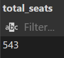


## **Query 2**: Statewise seats in total

**Code:**
```sql
SELECT
    s.state AS State_Name,
    count(cr.parliament_constituency) AS Total_Seats
FROM
    constituencywise_results AS cr
INNER JOIN
    statewise_results AS sr ON sr.parliament_constituency = cr.parliament_constituency
INNER JOIN
    States AS s ON s.state_id = sr.state_id
GROUP BY
    s.state
ORDER BY
    count(cr.parliament_constituency) DESC;
```

**Output:**
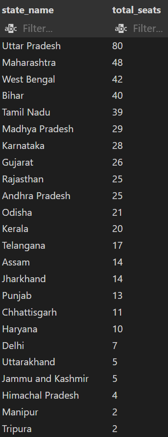

## **Query 3**: Total seats won by NDA

**Code:**
```sql
SELECT
    SUM(
        CASE
            WHEN party IN (
                'Bharatiya Janata Party - BJP',
                'Telugu Desam - TDP',
                'Janata Dal  (United) - JD(U)',
                'Shiv Sena - SHS',
                'AJSU Party - AJSUP',
                --'Pattali Makkal Katchi',
                'Lok Janshakti Party(Ram Vilas) - LJPRV',
                'Nationalist Congress Party - NCP',
                --'Bharath Dharma Jana Sena',
                'Janata Dal  (Secular) - JD(S)',
                --'Tamil Maanila Congress (Moopanar)',
                --'Amma Makkal Munnetra Kazhagam',
                'Apna Dal (Soneylal) - ADAL',
                'Asom Gana Parishad - AGP',
                'Janasena Party - JnP',
                --'National People's Party',
                'Rashtriya Lok Dal - RLD',
                --'All Jharkhand Students Union',
                'Hindustani Awam Morcha (Secular) - HAMS',
                --'Naga Peoples Front',
                --'Nationalist Democratic Progressive Party',
                'Sikkim Krantikari Morcha - SKM'
                --'Rashtriya Lok Morcha',
                --'Rashtriya Samaj Paksha',
                --'Suheldev Bharatiya Samaj Party',
                --'United People''s Party, Liberal - UPPL',
                --'Independent - IND'
                ) THEN won          -- can also use ["won"]
                ELSE 0
            END) AS NDA_Total_Seats_Won
FROM 
    partywise_results
```

**Output:**
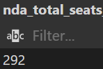

## **Query 4:** Total seats won by NDA parties

**Code:**
```sql
SELECT 
    party AS Party,
    won AS Total_Seats
FROM 
    partywise_results 
WHERE
     party IN (
                'Bharatiya Janata Party - BJP',
                'Telugu Desam - TDP',
                'Janata Dal  (United) - JD(U)',
                'Shiv Sena - SHS',
                'AJSU Party - AJSUP',
                --'Pattali Makkal Katchi',
                'Lok Janshakti Party(Ram Vilas) - LJPRV',
                'Nationalist Congress Party - NCP',
                --'Bharath Dharma Jana Sena',
                'Janata Dal  (Secular) - JD(S)',
                --'Tamil Maanila Congress (Moopanar)',
                --'Amma Makkal Munnetra Kazhagam',
                'Apna Dal (Soneylal) - ADAL',
                'Asom Gana Parishad - AGP',
                'Janasena Party - JnP',
                --'National People's Party',
                'Rashtriya Lok Dal - RLD',
                --'All Jharkhand Students Union',
                'Hindustani Awam Morcha (Secular) - HAMS',
                --'Naga Peoples Front',
                --'Nationalist Democratic Progressive Party',
                'Sikkim Krantikari Morcha - SKM'
                --'Rashtriya Lok Morcha',
                --'Rashtriya Samaj Paksha',
                --'Suheldev Bharatiya Samaj Party',
                --'United People''s Party, Liberal - UPPL',
                --'Independent - IND'
                )
ORDER BY
    won DESC;
```

*NDA parties commented out in the above code are the parties that didn't win any seats.*

**Output:**
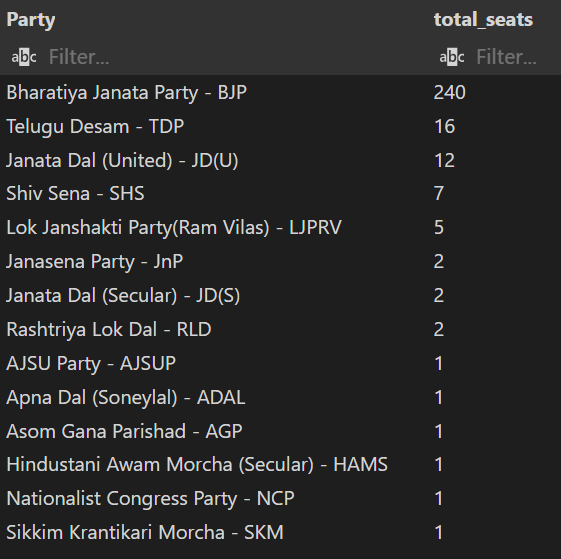


## **Query 5:** Total seats won by I.N.D.I.A

**Code:**
```sql
SELECT
    SUM(
        CASE
            WHEN party IN (
                'Indian National Congress - INC',
                'Aam Aadmi Party - AAAP',
                'All India Trinamool Congress - AITC',
                'Bharat Adivasi Party - BHRTADVSIP',
                'Communist Party of India  (Marxist) - CPI(M)',
                'Communist Party of India  (Marxist-Leninist)  (Liberation) - CPI(ML)(L)',
                'Communist Party of India - CPI',
                'Dravida Munnetra Kazhagam - DMK',
                'Indian Union Muslim League - IUML',
                'Nat`Jammu & Kashmir National Conference - JKN',
                'Jharkhand Mukti Morcha - JMM',
                'Jammu & Kashmir National Conference - JKN',
                'Kerala Congress - KEC',
                'Marumalarchi Dravida Munnetra Kazhagam - MDMK',
                'Nationalist Congress Party Sharadchandra Pawar - NCPSP',
                'Rashtriya Janata Dal - RJD',
                'Rashtriya Loktantrik Party - RLTP',
                'Revolutionary Socialist Party - RSP',
                'Samajwadi Party - SP',
                'Shiv Sena (Uddhav Balasaheb Thackrey) - SHSUBT',
                'Viduthalai Chiruthaigal Katchi - VCK'
            ) THEN won
            ELSE 0
        END) AS I_N_D_I_A_Seats_Won
FROM 
    partywise_results
```

**Output:**
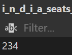

## **Query 6:** Total seats won by I.N.D.I.A parties

**Code:**
```sql
SELECT
    party as Party_Name,
    won AS Total_Seats
FROM partywise_results
WHERE
    party IN (
                'Indian National Congress - INC',
                'Aam Aadmi Party - AAAP',
                'All India Trinamool Congress - AITC',
                'Bharat Adivasi Party - BHRTADVSIP',
                'Communist Party of India  (Marxist) - CPI(M)',
                'Communist Party of India  (Marxist-Leninist)  (Liberation) - CPI(ML)(L)',
                'Communist Party of India - CPI',
                'Dravida Munnetra Kazhagam - DMK',
                'Indian Union Muslim League - IUML',
                'Nat`Jammu & Kashmir National Conference - JKN',
                'Jharkhand Mukti Morcha - JMM',
                'Jammu & Kashmir National Conference - JKN',
                'Kerala Congress - KEC',
                'Marumalarchi Dravida Munnetra Kazhagam - MDMK',
                'Nationalist Congress Party Sharadchandra Pawar - NCPSP',
                'Rashtriya Janata Dal - RJD',
                'Rashtriya Loktantrik Party - RLTP',
                'Revolutionary Socialist Party - RSP',
                'Samajwadi Party - SP',
                'Shiv Sena (Uddhav Balasaheb Thackrey) - SHSUBT',
                'Viduthalai Chiruthaigal Katchi - VCK'
            )
ORDER BY
    Total_Seats DESC;
```

**Output:**
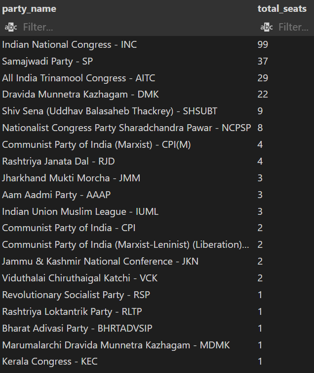

## **Query 7:** Categorize the parties into their respective alliance

1) Create a new column for holding the alliance name:
```sql
ALTER TABLE 
    partywise_results
ADD 
    party_alliance VARCHAR(50)
```
2) Categorize the NDA parties
```sql
UPDATE 
    partywise_results
SET 
    party_alliance = 'NDA'
WHERE
    party IN (
            'Bharatiya Janata Party - BJP',
            'Telugu Desam - TDP',
            'Janata Dal  (United) - JD(U)',
            'Shiv Sena - SHS',
            'AJSU Party - AJSUP',
            'Lok Janshakti Party(Ram Vilas) - LJPRV',
            'Nationalist Congress Party - NCP',
            'Janata Dal  (Secular) - JD(S)',
            'Apna Dal (Soneylal) - ADAL',
            'Asom Gana Parishad - AGP',
            'Janasena Party - JnP',
            'Rashtriya Lok Dal - RLD',
            'Hindustani Awam Morcha (Secular) - HAMS',
            'Sikkim Krantikari Morcha - SKM'
        );
```
3) Categorize the I.N.D.I.A parties
```sql
UPDATE 
    partywise_results
SET 
    party_alliance = 'I.N.D.I.A'
WHERE
    party IN (
                'Indian National Congress - INC',
                'Aam Aadmi Party - AAAP',
                'All India Trinamool Congress - AITC',
                'Bharat Adivasi Party - BHRTADVSIP',
                'Communist Party of India  (Marxist) - CPI(M)',
                'Communist Party of India  (Marxist-Leninist)  (Liberation) - CPI(ML)(L)',
                'Communist Party of India - CPI',
                'Dravida Munnetra Kazhagam - DMK',
                'Indian Union Muslim League - IUML',
                'Nat`Jammu & Kashmir National Conference - JKN',
                'Jharkhand Mukti Morcha - JMM',
                'Jammu & Kashmir National Conference - JKN',
                'Kerala Congress - KEC',
                'Marumalarchi Dravida Munnetra Kazhagam - MDMK',
                'Nationalist Congress Party Sharadchandra Pawar - NCPSP',
                'Rashtriya Janata Dal - RJD',
                'Rashtriya Loktantrik Party - RLTP',
                'Revolutionary Socialist Party - RSP',
                'Samajwadi Party - SP',
                'Shiv Sena (Uddhav Balasaheb Thackrey) - SHSUBT',
                'Viduthalai Chiruthaigal Katchi - VCK'
        );
```
4) The remaining parties are categorized as 'Other'
```sql
UPDATE 
    partywise_results
SET 
    party_alliance = 'Other'
WHERE 
    party_alliance IS NULL;
```
5) ```SELECT * FROM partywise_results```
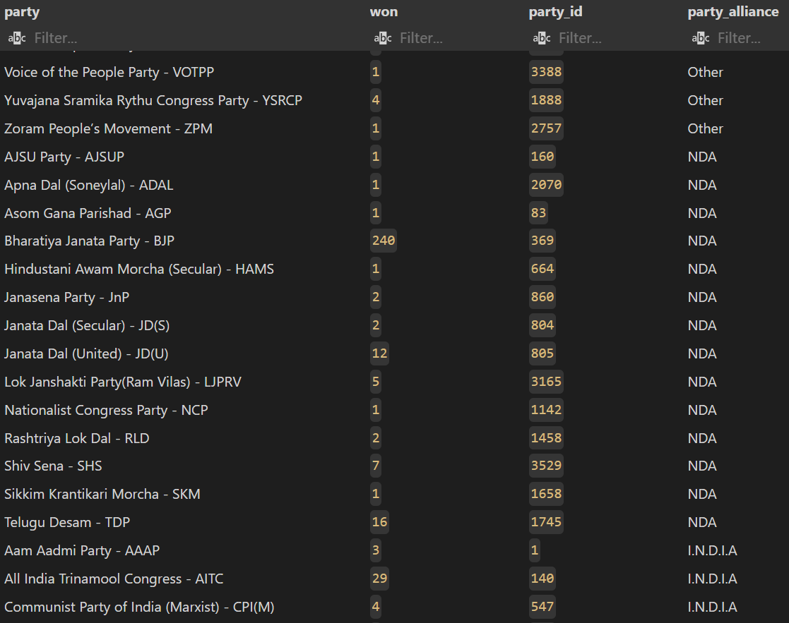

What this new column enables us to do is to quickly retrieve the results we had coded a lot for earlier. Below is an example of how shorter queries give the same results:

```sql
SELECT 
    party,
    won
FROM
    partywise_results
WHERE
    party_alliance = 'NDA'
ORDER BY 
    won DESC
```
**Ouput:**
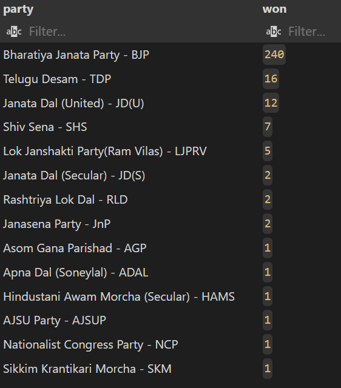

Reshaping **Query 4** into just a few lines of code, we are able to bypass the need to list out all the party names under a particular alliance, which is a tedious task.

## **Query 8:** List out the winning candidate details for a specific state/constituency

**Code:**
```sql
SELECT
    cr.winning_candidate,
    pr.party,
    pr.party_alliance,
    cr.total_votes,
    cr.margin,
    s.state,
    cr.constituency_name
FROM
    constituencywise_results as cr
INNER JOIN
    partywise_results AS pr ON cr.party_id = pr.party_id
INNER JOIN
    statewise_results AS sr ON cr.parliament_constituency = sr.parliament_constituency
INNER JOIN
    states AS s ON sr.state_id = s.state_id
WHERE
    cr.constituency_name = 'KOLLAM'
    -- s.state = 'Tamil Nadu'
    -- pr.party_alliance = 'NDA' 
ORDER BY
    total_votes DESC;
```
**Output:**


For getting the winning details of the candidate from a specific state, we can make a small change in the ```WHERE``` clause as below:
```sql
WHERE
   s.state = 'Tamil Nadu'
```
**Output:**
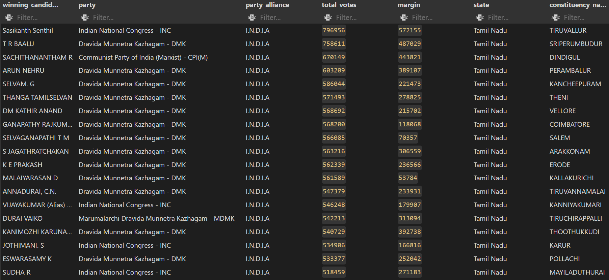

For the winning candidate details from a specific party alliance, we can change it as follows:
```sql
WHERE
    pr.party_alliance = 'NDA' 
```
**Output:**
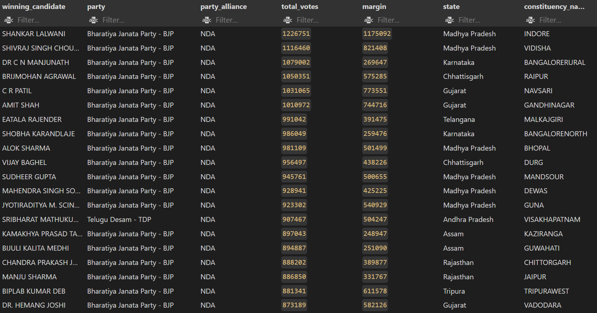

## **Query 9:** EVM vs Postal votes

**Code:**
```sql
SELECT 
    cd.candidate,
    cr.constituency_name,
    cd.evm_votes,
    cd.postal_votes
FROM 
    constituencywise_details AS cd
INNER JOIN
    constituencywise_results AS cr on cd.const_id = cr.const_id
WHERE 
    cr.constituency_name = 'AMETHI'
ORDER BY
    evm_votes DESC;
```

**Sample Output:**
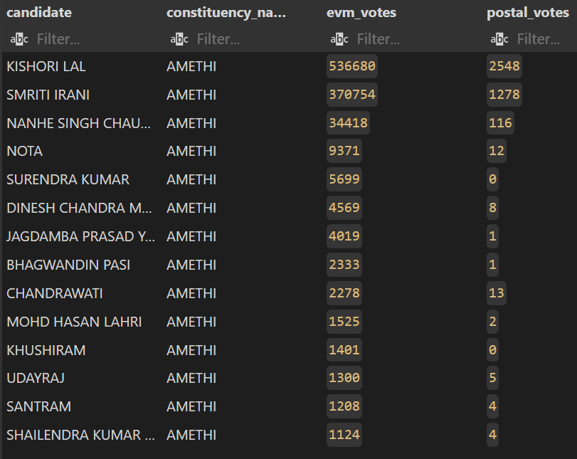

## **Query 10:** Parties that won the most seats in a state

**Code:**
```sql
SELECT
    pr.party,
    count(cr.const_id) AS Total_Votes
FROM
    constituencywise_results AS cr
INNER JOIN
    partywise_results AS pr ON pr.party_id = cr.party_id
INNER JOIN
    statewise_results AS sr on sr.parliament_constituency = cr.parliament_constituency
INNER JOIN
    states as s on s.state_id = sr.state_id
WHERE 
    s.state = 'Uttar Pradesh'
GROUP BY 
    pr.party
ORDER BY
    Total_Votes DESC;
```
**Output:**
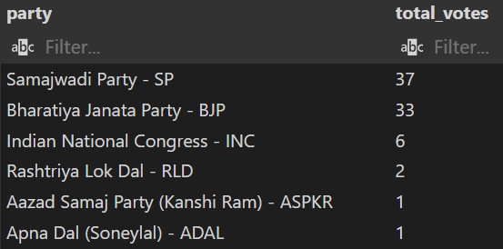

## **Query 11:** Total number of seats won by each party alliance in each state

**Code:**
```sql
SELECT
    s.state AS State,
    SUM(CASE WHEN pr.party_alliance = 'NDA' THEN 1 ELSE 0 END) AS NDA_Seats_Won,
    SUM(CASE WHEN pr.party_alliance = 'I.N.D.I.A' THEN 1 ELSE 0 END) AS INDIA_Seats_Won,
    SUM(CASE WHEN pr.party_alliance = 'Other' THEN 1 ELSE 0 END) AS Other_Seats_Won
FROM
    constituencywise_results AS cr
INNER JOIN
    partywise_results AS pr ON pr.party_id = cr.party_id
INNER JOIN
    statewise_results AS sr ON sr.parliament_constituency = cr.parliament_constituency
INNER JOIN
    states AS s ON s.state_id = sr.state_id
WHERE
    s.state = 'Assam'
GROUP BY
    s.state;
```

**Output:**


To get a statewise view, we simply remove the ```WHERE``` clause, to get the following output:
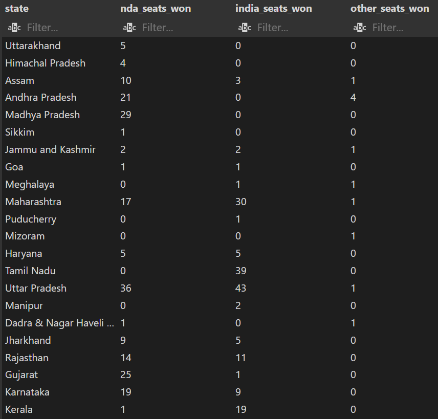

## **Query 12:** Top 10 candidates with the highest number of EVM votes in each constituency

**Code:**
```sql
SELECT DISTINCT
    cd.candidate AS Candidate_Name,
    cr.constituency_name AS Constituency,
    MAX(cd.evm_votes) AS Highest_EVM_Votes
FROM 
    constituencywise_results AS cr
INNER JOIN
    constituencywise_details AS cd ON cd.const_id = cr.const_id
GROUP BY
    cd.candidate, cr.constituency_name
ORDER BY
    Highest_EVM_Votes DESC
LIMIT 10; -- for top 10 highest EVM votes
```
**Output:**
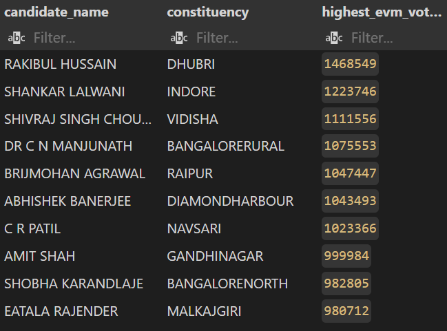

## **Query 13:** Top 10 Winner vs Runner-up candidates in each constituency of a state

For this query, there are two possible solutions:
1) Using ```ROW_NUMBER()``` and ```WITH()```
2) Using only ```INNER JOIN```

**Code 1:**
```sql
WITH RankedCandidates AS (
    SELECT 
        cd.const_id,
        cd.candidate,
        cd.party,
        cd.evm_votes,
        cd.postal_votes,
        cd.evm_votes + cd.postal_votes AS Total_Votes,
        cr.margin,
        ROW_NUMBER() OVER (PARTITION BY cd.const_id ORDER BY cd.evm_votes + cd.postal_votes DESC) AS VoteRank
    FROM 
        constituencywise_details AS cd
    JOIN 
        constituencywise_results AS cr ON cd.const_id = cr.const_id
    JOIN 
        statewise_results AS sr ON cr.Parliament_Constituency = sr.Parliament_Constituency
    JOIN 
        states AS s ON sr.state_id = s.state_id
    WHERE 
        s.state = 'Maharashtra'
)

SELECT 
    cr.constituency_name AS Constituency,
    MAX(CASE WHEN rc.VoteRank = 1 THEN rc.Candidate END) AS Winning_Candidate,
    MAX(CASE WHEN rc.VoteRank = 2 THEN rc.Candidate END) AS Runnerup_Candidate,
    cr.margin AS Victory_Margin
FROM 
    RankedCandidates AS rc
JOIN 
    constituencywise_results AS cr ON rc.const_id = cr.const_id
GROUP BY 
    cr.constituency_name, cr.margin
ORDER BY 
    cr.margin DESC
LIMIT 10;
```

**Output:**

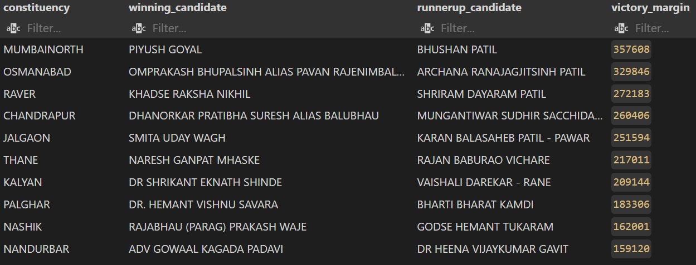

**Code 2:**
The same result set can be retrieved by a more concise code as below:
```sql
SELECT
    cr.constituency_name AS constituency,
    cr.winning_candidate AS Winning_Candidate,
    sr.trailing_candidate AS Runnerup_Candidate,
    cr.margin AS Victory_Margin
FROM
    constituencywise_results AS cr
INNER JOIN
    statewise_results AS sr ON sr.parliament_constituency = cr.parliament_constituency
INNER JOIN
    states AS s ON s.state_id = sr.state_id
WHERE 
    s.state = 'Maharashtra'
ORDER BY
    cr.margin DESC
LIMIT 10; 
```

## **Query 14:** For a given state, list out the following:
            1. Total number of designated seats
            2. Total number of contesting candidates
            3. Total number of contesting parties
            4. Total number of EVM votes
            5. Total number of postal Votes
            6. Total number of overall votes

**Code:**
```sql
WITH state_view AS
    (SELECT
        s.state,
        count(DISTINCT cr.const_id) AS Total_Seats,
        count(DISTINCT cd.candidate) AS Total_Candidates,
        count(DISTINCT pr.party) AS Total_Parties,
        sum(cd.evm_votes) AS Total_EVM_Votes,
        sum(cd.postal_votes) AS Total_Postal_Votes,
        sum(cd.evm_votes + cd.postal_votes) AS Total_Votes
    FROM 
        constituencywise_results AS cr
    INNER JOIN
        constituencywise_details AS cd ON cd.const_id = cr.const_id
    INNER JOIN
        statewise_results AS sr ON sr.parliament_constituency = cr.parliament_constituency
    INNER JOIN 
        states AS s ON s.state_id = sr.state_id
    INNER JOIN
        partywise_results AS pr ON pr.party_id = cr.party_id
    GROUP BY
        s.state
    )

SELECT
    sv.state,
    Total_Seats,
    Total_Candidates,
    Total_Parties,
    Total_EVM_Votes,
    Total_Postal_Votes,
    Total_Votes
FROM 
    state_view AS sv
WHERE 
    sv.state = 'Bihar'
```

**Output:**
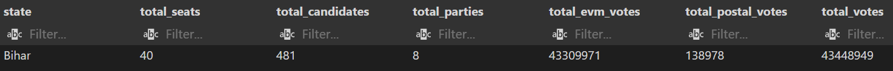

We can refer to the below table for verifying the numbers:
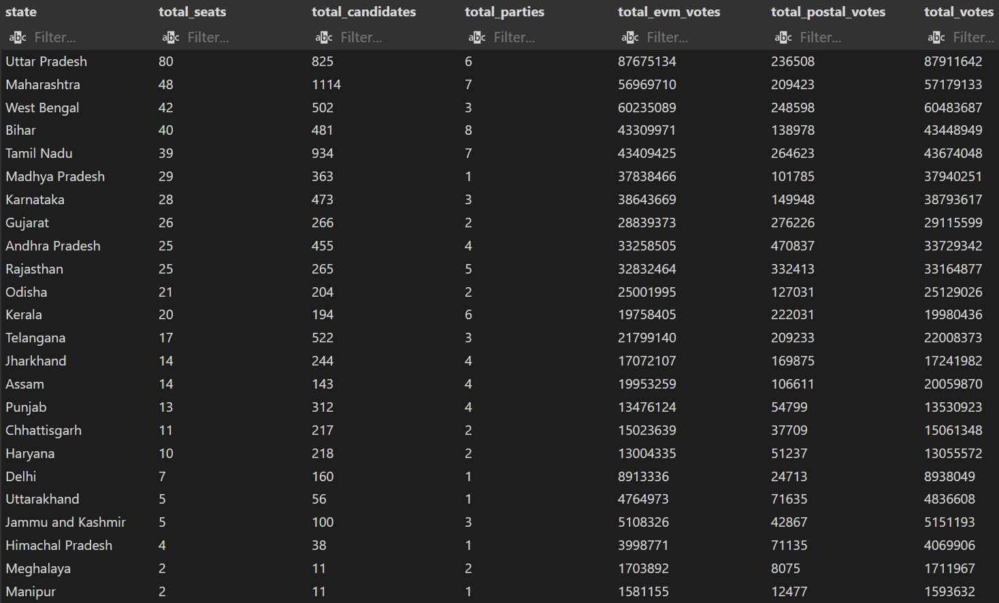

This statewise list was developed using the following code:
```sql
SELECT
    s.state,
    count(DISTINCT cr.const_id) AS Total_Seats,
    count(DISTINCT cd.candidate) AS Total_Candidates,
    count(DISTINCT pr.party) AS Total_Parties,
    sum(cd.evm_votes) AS Total_EVM_Votes,
    sum(cd.postal_votes) AS Total_Postal_Votes,
    sum(cd.evm_votes + cd.postal_votes) AS Total_Votes
FROM 
    constituencywise_results AS cr
INNER JOIN
    statewise_results AS sr ON sr.parliament_constituency = cr.parliament_constituency
INNER JOIN
    states AS s ON s.state_id = sr.state_id
INNER JOIN
    constituencywise_details AS cd ON cd.const_id = cr.const_id
INNER JOIN
    partywise_results AS pr ON pr.party_id = cr.party_id
GROUP BY
    s.state
ORDER BY
    Total_Seats DESC;
```
